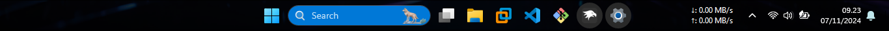

# Time Fragment (Colored Search Box and Circle App Button)
**Description**: In the next 2-5 years, I think this theme will be applied by default to Windows 12.

**Author**: [cilegordev](https://github.com/cilegordev)



## Theme selection

The theme is **not** integrated into the mod, and can be simply selected from the mod's
settings:

* Open the Windows 11 Taskbar Styler mod in Windhawk.
* Go to the "Settings" tab.
* Select the theme and save the settings.

## Manual installation

The theme styles can also be imported manually. To do that, follow these steps:

* Open the Windows 11 Taskbar Styler mod in Windhawk.
* Go to the "Advanced" tab.
* Copy the content below to the text box under "Mod settings" and click "Save".

<details>
<summary>Content to import (click to expand)</summary>

```json
{
  "controlStyles[0].target": "Windows.UI.Xaml.Shapes.Rectangle#BackgroundFill",
  "controlStyles[0].styles[0]": "Fill=#CC000000",
  "controlStyles[1].target": "Taskbar.SearchBoxButton > Taskbar.TaskListButtonPanel > Windows.UI.Xaml.Controls.Border",
  "controlStyles[1].styles[0]": "Background=#0078D7",
  "controlStyles[1].styles[1]": "CornerRadius=16",
  "controlStyles[2].target": "Microsoft.UI.Xaml.Controls.AnimatedVisualPlayer > Icon > Windows.UI.Xaml.Controls.TextBlock > SearchBoxTextBlock > Windows.UI.Xaml.Controls.Grid > DynamicSearchBoxGleamImage",
  "controlStyles[2].styles[0]": "ActualTheme=1",
  "controlStyles[3].target": "Taskbar.TaskListLabeledButtonPanel@RunningIndicatorStates > Border#BackgroundElement",
  "controlStyles[3].styles[0]": "CornerRadius=32",
  "controlStyles[4].target": "Taskbar.TaskListLabeledButtonPanel@CommonStates > Rectangle#RunningIndicator",
  "controlStyles[4].styles[0]": "Fill=#292929",
  "controlStyles[4].styles[1]": "StrokeThickness=2",
  "controlStyles[4].styles[2]": "Stroke@InactivePointerOver=#FFFFFF",
  "controlStyles[4].styles[3]": "Stroke@InactivePressed=#FFFFFF",
  "controlStyles[4].styles[4]": "Stroke@ActiveNormal=#FFFFFF",
  "controlStyles[4].styles[5]": "Stroke@ActivePointerOver=#FFFFFF",
  "controlStyles[4].styles[6]": "Stroke@ActivePressed=#FFFFFF",
  "controlStyles[4].styles[7]": "Width=40",
  "controlStyles[4].styles[8]": "Height=40",
  "controlStyles[4].styles[9]": "RadiusX=32",
  "controlStyles[4].styles[10]": "RadiusY=32",
  "controlStyles[4].styles[11]": "Margin=0"
}
```
</details>

## Notes

* Need to fix colored **Text Search** `Windows.UI.Xaml.Controls.TextBlock > SearchBoxTextBlock`
* Mod selection on Windhawk coming soon ...

## Credits

* Inspiration : [Bubbles](https://github.com/ramensoftware/windows-11-taskbar-styling-guide/tree/main/Themes/Bubbles)
* Mod Patcher : [Windhawk](https://github.com/ramensoftware/windhawk)
* Helper Styling : [Uwpspy](https://github.com/m417z/UWPSpy)
* Net Speed Monitor : [TrafficMonitor](https://github.com/zhongyang219/TrafficMonitor)
